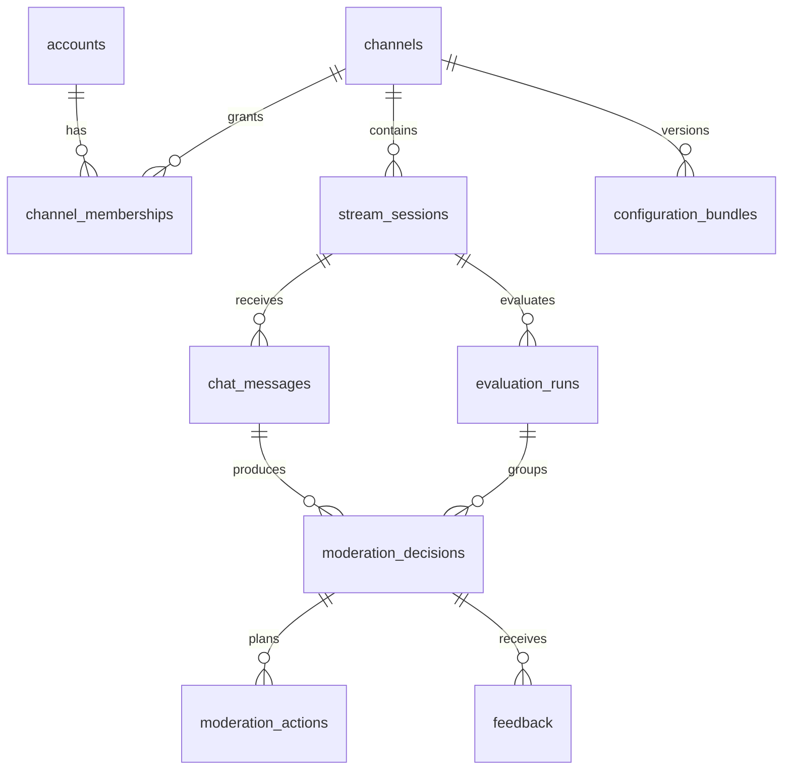

# MVP database schema

Status: original PostgreSQL design, written before migrations were applied. It documents the first simulation milestone rather than the complete current schema. Later migrations and the [updated product direction](04-live-product-direction.md) extend this foundation. snake_case naming is used consistently in the database and wire contracts. UUIDs are generated by the application; timestamps use UTC timestamptz. All columns are required unless marked `?` (nullable). JSONB is validated against the same contract version used by the API/worker.

## Relationships

## Tables and fields

| Table                 | Columns                                                                                                                                                                                                                                                                                                      |
| --------------------- | ------------------------------------------------------------------------------------------------------------------------------------------------------------------------------------------------------------------------------------------------------------------------------------------------------------ |
| accounts              | id uuid PK; display_name text; created_at timestamptz                                                                                                                                                                                                                                                        |
| channels              | id uuid PK; display_name text; created_at timestamptz                                                                                                                                                                                                                                                        |
| channel_memberships   | channel_id uuid; account_id uuid; role text; created_at timestamptz; PK(channel_id, account_id)                                                                                                                                                                                                              |
| stream_sessions       | id uuid PK; channel_id uuid; label text; source text = SYNTHETIC; created_at timestamptz; closed_at? timestamptz                                                                                                                                                                                             |
| configuration_bundles | id uuid PK; channel_id uuid; schema_version integer; processor_version text; ruleset_version text; policy_version text; model_status text = DISABLED; configuration jsonb; content_hash text; created_at timestamptz                                                                                         |
| evaluation_runs       | id uuid PK; channel_id uuid; session_id uuid; configuration_bundle_id uuid; kind text = PRIMARY; mode text = SIMULATION; created_at timestamptz                                                                                                                                                              |
| chat_messages         | id uuid PK; channel_id uuid; session_id uuid; source text = SYNTHETIC; external_message_id text; author_external_id text; author_display_name text; raw_text text; published_at timestamptz; received_at timestamptz; ingestion_hash text                                                                    |
| processing_tasks      | id uuid PK; channel_id uuid; session_id uuid; message_id uuid; evaluation_run_id uuid; status text; attempts integer default 0; last_error_code? text; created_at timestamptz; updated_at timestamptz                                                                                                        |
| moderation_decisions  | id uuid PK; channel_id uuid; session_id uuid; message_id uuid; evaluation_run_id uuid; outcome text; primary_category? text; severity? smallint; confidence? numeric; reason_code text; reason text; representations jsonb; signals jsonb; risk_snapshot jsonb; version_bundle jsonb; created_at timestamptz |
| moderation_actions    | id uuid PK; channel_id uuid; decision_id uuid; action_index integer; action_type text; target_kind text; target_external_id text; duration_seconds? integer; status text; idempotency_key text; created_at timestamptz; completed_at? timestamptz                                                            |
| feedback              | id uuid PK; channel_id uuid; decision_id uuid; reviewer_id uuid; label text; corrected_category? text; corrected_outcome? text; notes? text; request_key text; request_hash text; created_at timestamptz                                                                                                     |
| audit_events          | id uuid PK; channel_id uuid; actor_account_id? uuid; actor_type text; event_type text; entity_type text; entity_id uuid; metadata jsonb; trace_id uuid; created_at timestamptz                                                                                                                               |
| outbox_events         | event_id uuid PK; channel_id uuid; session_id? uuid; event_type text; schema_version integer; trace_id uuid; payload jsonb; occurred_at timestamptz; dispatched_at? timestamptz; lease_until? timestamptz; attempts integer default 0                                                                        |
| feed_events           | channel_id uuid; sequence bigint; event_id uuid UNIQUE; event_type text; resource_id uuid; session_id uuid; created_at timestamptz; PK(channel_id, sequence)                                                                                                                                                 |
| channel_feed_counters | channel_id uuid PK; last_sequence bigint default 0                                                                                                                                                                                                                                                           |

The MVP stores representations/signals/risk as JSONB snapshots on the decision. Separate tables for individual signals or ChatAuthor identities are not yet required. An account is a dashboard identity; author_external_id is a chat identity and has no foreign key to accounts.

## Constraints

- All scoped tables have a foreign key to channels. Scoped parents provide `UNIQUE(channel_id, id)`; relationships use composite foreign keys `(channel_id, parent_id)` to prevent cross-channel references.
- Messages have `UNIQUE(channel_id, session_id, source, external_message_id)`.
- Runs have a foreign key `(channel_id, session_id)` to sessions, a foreign key `(channel_id, configuration_bundle_id)` to bundles, and `UNIQUE(channel_id, session_id, kind)` for PRIMARY in the first milestone.
- Tasks have `UNIQUE(message_id, evaluation_run_id)`. Decisions have the same uniqueness constraint. Messages and runs provide `UNIQUE(channel_id, session_id, id)`; tasks/decisions use foreign keys `(channel_id, session_id, message_id)` and `(channel_id, session_id, evaluation_run_id)` to their respective parents to prevent cross-session message/run references.
- Actions have `UNIQUE(decision_id, action_index)` and `UNIQUE(idempotency_key)`. action_index ≥ 0. The first milestone enforces CHECK constraints for `action_type = 'DELETE'`, `target_kind = 'MESSAGE'`, `duration_seconds IS NULL`, `status = 'SIMULATED'`, and a populated completed_at.
- Outcomes are ALLOW/REVIEW/ACTION_REQUIRED/ERROR. Severity is nullable or 0–4; confidence is nullable or 0–1. The demo stores null confidence. ALLOW uses severity 0; ERROR uses null.
- Within a decision transaction, ACTION_REQUIRED must have at least one action; other outcomes must have none. Services and integration tests enforce cross-table invariants.
- Task statuses are QUEUED/RUNNING/COMPLETED/FAILED. COMPLETED requires a non-ERROR decision; FAILED requires an ERROR decision after retries are exhausted.
- Feedback labels are CORRECT/FALSE_POSITIVE/FALSE_NEGATIVE/WRONG_CATEGORY/CONTEXT_MISUNDERSTOOD. WRONG_CATEGORY requires corrected_category; FALSE_NEGATIVE requires corrected_category and corrected_outcome REVIEW or ACTION_REQUIRED; FALSE_POSITIVE requires corrected_outcome ALLOW.
- Feedback has `UNIQUE(channel_id, reviewer_id, request_key)`. The reviewer must be an authorized member when the request is processed; never accept reviewer_id from the client.
- Bundles are immutable with `UNIQUE(channel_id, content_hash)`. The rule, processor, policy, and model status in a decision's version_bundle must match the selected run.
- Audit records, decisions, bundles, and feedback are append-only through the application role. Retention/deletion will use separate administrative jobs; append-only does not prohibit deleting data forever.

## Primary access indexes

- decisions `(channel_id, created_at DESC, id DESC)` and `(channel_id, outcome, created_at DESC, id DESC)`.
- messages `(channel_id, session_id, received_at DESC, id DESC)`.
- feedback `(channel_id, decision_id, created_at, id)`.
- audit `(channel_id, created_at DESC, id DESC)`.
- outbox partial index `(occurred_at, event_id) WHERE dispatched_at IS NULL`.
- processing_tasks `(status, updated_at)` for stuck-job reconciliation.
- The feed_events primary key is sufficient for resuming a channel feed. Sequence values are allocated transactionally under a channel_feed_counters row lock, not through a global sequence that can commit out of order.

## Transactions

**Ingestion:** validate membership/session → hash canonical input fields → insert the message or compare the existing hash → insert the task and `chat.accepted` outbox event → commit → return 202. An existing ID with different content returns 409 without overwriting raw_text. Identical duplicates return the existing task/decision.

**Processing:** run the deterministic core against the message and pinned bundle → lock the task within a transaction → return the existing decision if present → insert the decision, a SIMULATED action if required, audit record, and feed_event, and update the task to COMPLETED → commit. No provider calls occur. Competing retries are resolved through unique constraints and retrieval of existing results, not false ERROR decisions.

**Terminal failure:** after attempts are exhausted, lock the task within a transaction and verify it is unfinished → insert an ERROR decision, audit record, and feed_event → update the task to FAILED. A reconciler handles lost jobs/worker crashes; tasks must not remain QUEUED/RUNNING indefinitely.

**Feedback:** validate the actor → perform an idempotency lookup → insert feedback, audit, and feed_event in one transaction. Feedback does not overwrite the original decision or trigger a new action.

## Outbox and feed delivery

The dispatcher claims an outbox event with a lease, then enqueues it using event_id as the job identity. A crash after enqueue can cause redelivery; correctness depends on database task/decision uniqueness, not Redis job retention. Dispatch is marked delivered only after a successful enqueue. Dispatcher retries use bounded intervals/backoff, while events remain stored until delivery succeeds or they are investigated.

The original SSE feed reads persisted feed_events. Every UI-visible change writes an event in the same transaction as the resource. Per-channel sequence values are allocated last using a consistent lock order so cursors cannot skip uncommitted transactions.

## MVP boundaries

The schema intentionally restricts the mode to SIMULATION and actions to simulated DELETE. Adding provider actions requires migrations for statuses, attempts, leases, and reconciliation; an environment flag alone is insufficient. Fixtures remain stored locally without automatic cleanup until an explicit development reset. Retention for real data has not been defined.
