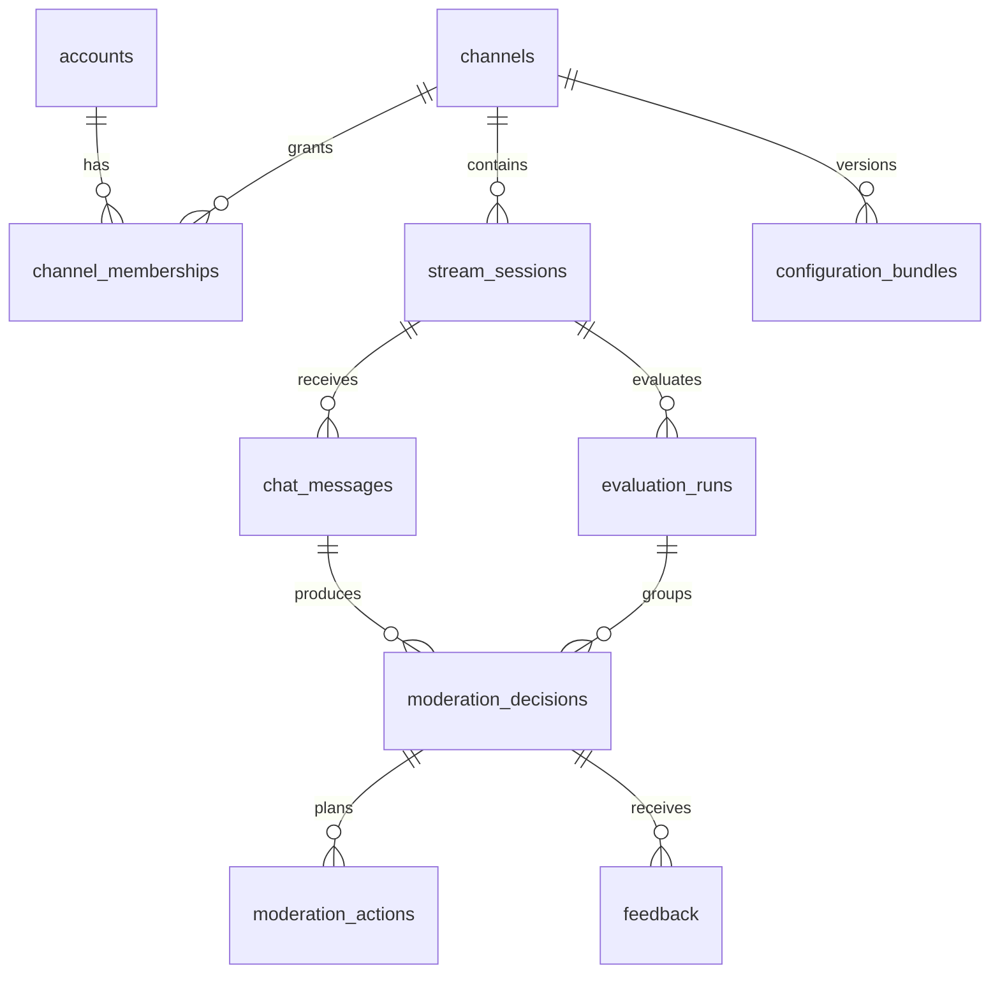

# Schema database MVP

Status: rancangan PostgreSQL; belum ada migration yang diterapkan. Nama snake_case dipakai konsisten pada database dan wire contract. UUID dibuat aplikasi; waktu memakai timestamptz UTC. Semua kolom wajib kecuali ditandai `?` (nullable). JSONB divalidasi menggunakan kontrak versi yang sama dengan API/worker.

## Relasi

## Tabel dan field

| Tabel | Kolom |
| --- | --- |
| accounts | id uuid PK; display_name text; created_at timestamptz |
| channels | id uuid PK; display_name text; created_at timestamptz |
| channel_memberships | channel_id uuid; account_id uuid; role text; created_at timestamptz; PK(channel_id, account_id) |
| stream_sessions | id uuid PK; channel_id uuid; label text; source text = SYNTHETIC; created_at timestamptz; closed_at? timestamptz |
| configuration_bundles | id uuid PK; channel_id uuid; schema_version integer; processor_version text; ruleset_version text; policy_version text; model_status text = DISABLED; configuration jsonb; content_hash text; created_at timestamptz |
| evaluation_runs | id uuid PK; channel_id uuid; session_id uuid; configuration_bundle_id uuid; kind text = PRIMARY; mode text = SIMULATION; created_at timestamptz |
| chat_messages | id uuid PK; channel_id uuid; session_id uuid; source text = SYNTHETIC; external_message_id text; author_external_id text; author_display_name text; raw_text text; published_at timestamptz; received_at timestamptz; ingestion_hash text |
| processing_tasks | id uuid PK; channel_id uuid; session_id uuid; message_id uuid; evaluation_run_id uuid; status text; attempts integer default 0; last_error_code? text; created_at timestamptz; updated_at timestamptz |
| moderation_decisions | id uuid PK; channel_id uuid; session_id uuid; message_id uuid; evaluation_run_id uuid; outcome text; primary_category? text; severity? smallint; confidence? numeric; reason_code text; reason text; representations jsonb; signals jsonb; risk_snapshot jsonb; version_bundle jsonb; created_at timestamptz |
| moderation_actions | id uuid PK; channel_id uuid; decision_id uuid; action_index integer; action_type text; target_kind text; target_external_id text; duration_seconds? integer; status text; idempotency_key text; created_at timestamptz; completed_at? timestamptz |
| feedback | id uuid PK; channel_id uuid; decision_id uuid; reviewer_id uuid; label text; corrected_category? text; corrected_outcome? text; notes? text; request_key text; request_hash text; created_at timestamptz |
| audit_events | id uuid PK; channel_id uuid; actor_account_id? uuid; actor_type text; event_type text; entity_type text; entity_id uuid; metadata jsonb; trace_id uuid; created_at timestamptz |
| outbox_events | event_id uuid PK; channel_id uuid; session_id? uuid; event_type text; schema_version integer; trace_id uuid; payload jsonb; occurred_at timestamptz; dispatched_at? timestamptz; lease_until? timestamptz; attempts integer default 0 |
| feed_events | channel_id uuid; sequence bigint; event_id uuid UNIQUE; event_type text; resource_id uuid; session_id uuid; created_at timestamptz; PK(channel_id, sequence) |
| channel_feed_counters | channel_id uuid PK; last_sequence bigint default 0 |

MVP menyimpan representations/signals/risk sebagai snapshot JSONB di decision. Belum perlu tabel terpisah untuk setiap sinyal atau identitas ChatAuthor. Account adalah identitas dashboard; author_external_id adalah identitas chat dan tidak memiliki FK ke accounts.

## Constraints

- Semua tabel scoped memiliki FK ke channels. Parent scoped menyediakan `UNIQUE(channel_id, id)`; relasi antar tabel memakai FK komposit `(channel_id, parent_id)` agar tidak bisa menyilang channel.
- Message memiliki `UNIQUE(channel_id, session_id, source, external_message_id)`.
- Run memiliki FK `(channel_id, session_id)` ke session, FK `(channel_id, configuration_bundle_id)` ke bundle, dan `UNIQUE(channel_id, session_id, kind)` untuk PRIMARY milestone pertama.
- Task memiliki `UNIQUE(message_id, evaluation_run_id)`. Decision memiliki unique yang sama. Messages dan runs menyediakan `UNIQUE(channel_id, session_id, id)`; task/decision memakai FK `(channel_id, session_id, message_id)` dan `(channel_id, session_id, evaluation_run_id)` ke masing-masing parent agar message dan run tidak menyilang session.
- Action memiliki `UNIQUE(decision_id, action_index)` dan `UNIQUE(idempotency_key)`. action_index ≥ 0. Pada milestone pertama CHECK `action_type = 'DELETE'`, `target_kind = 'MESSAGE'`, `duration_seconds IS NULL`, `status = 'SIMULATED'`, serta completed_at terisi.
- Outcome dalam ALLOW/REVIEW/ACTION_REQUIRED/ERROR. Severity nullable atau 0–4; confidence nullable atau 0–1. Demo menyimpan confidence null. ALLOW memakai severity 0; ERROR memakai null.
- Dalam transaksi decision: ACTION_REQUIRED wajib memiliki minimal satu action; outcome lain tidak memiliki action. Invariant lintas tabel ditegakkan service dan integration test.
- Task status dalam QUEUED/RUNNING/COMPLETED/FAILED; COMPLETED wajib memiliki decision non-ERROR, FAILED wajib memiliki decision ERROR setelah retry habis.
- Feedback label dalam CORRECT/FALSE_POSITIVE/FALSE_NEGATIVE/WRONG_CATEGORY/CONTEXT_MISUNDERSTOOD. WRONG_CATEGORY wajib corrected_category; FALSE_NEGATIVE wajib corrected_category dan corrected_outcome REVIEW atau ACTION_REQUIRED; FALSE_POSITIVE wajib corrected_outcome ALLOW.
- Feedback memiliki `UNIQUE(channel_id, reviewer_id, request_key)`. Reviewer harus merupakan member yang diberi izin saat request diproses; jangan menerima reviewer_id dari client.
- Bundle bersifat immutable dengan `UNIQUE(channel_id, content_hash)`. Rule, processor, policy, dan model status dalam version_bundle decision harus sama dengan run yang dipakai.
- Audit, decision, bundle, dan feedback append-only melalui role aplikasi. Retensi/penghapusan memakai job administratif terpisah kelak; append-only bukan larangan penghapusan data selamanya.

## Index akses utama

- decisions `(channel_id, created_at DESC, id DESC)` dan `(channel_id, outcome, created_at DESC, id DESC)`.
- messages `(channel_id, session_id, received_at DESC, id DESC)`.
- feedback `(channel_id, decision_id, created_at, id)`.
- audit `(channel_id, created_at DESC, id DESC)`.
- outbox partial index `(occurred_at, event_id) WHERE dispatched_at IS NULL`.
- processing_tasks `(status, updated_at)` untuk rekonsiliasi job tersangkut.
- feed_events PK cukup untuk resume channel; sequence dialokasikan secara transactional di bawah lock baris channel_feed_counters, bukan sequence global yang bisa commit tidak berurutan.

## Transaksi

**Ingestion:** validasi membership/session → hash field input kanonis → insert message atau cocokkan hash existing → insert task dan outbox `chat.accepted` → commit → respons 202. ID existing dengan isi berbeda menjadi 409, tidak menimpa raw_text. Duplicate identik mengembalikan task/decision existing.

**Processing:** jalankan core deterministik terhadap message + bundle pinned → transaksi lock task → jika decision sudah ada, return existing → insert decision, action SIMULATED jika diperlukan, audit, feed_event, dan update task COMPLETED → commit. Tidak ada provider call. Retry yang berlomba diselesaikan unique constraint dan pengambilan existing, bukan menghasilkan ERROR palsu.

**Terminal failure:** setelah attempts habis, transaksi lock task dan periksa belum selesai → insert decision ERROR + audit + feed_event → update task FAILED. Reconciler menangani job hilang/worker crash; tidak boleh meninggalkan task QUEUED/RUNNING tanpa batas.

**Feedback:** validasi actor → idempotency lookup → insert feedback + audit + feed_event dalam satu transaksi. Feedback tidak menimpa keputusan asli dan tidak memicu action baru.

## Pengiriman outbox dan feed

Dispatcher claim outbox dengan lease lalu enqueue memakai event_id sebagai job identity. Crash setelah enqueue bisa mengirim ulang; kebenaran bergantung pada unique task/decision database, bukan umur retensi job Redis. Dispatch hanya menandai delivered setelah enqueue berhasil. Retry dispatcher dibatasi interval/backoff tetapi event tetap tersimpan sampai berhasil atau diinvestigasi.

Feed SSE membaca feed_events yang persisted. Tiap perubahan yang terlihat UI menulis event dalam transaksi yang sama dengan resource. Sequence per channel dialokasikan terakhir dengan urutan lock konsisten agar tidak membuat cursor melewati transaksi yang belum commit.

## Batas MVP

Schema sengaja membatasi mode SIMULATION dan DELETE simulasi. Menambahkan action provider memerlukan migration status/attempt/lease/reconciliation; jangan sekadar mengganti environment flag. Fixture disimpan lokal tanpa cleanup otomatis sampai development reset eksplisit. Retensi untuk data nyata belum ditetapkan.
